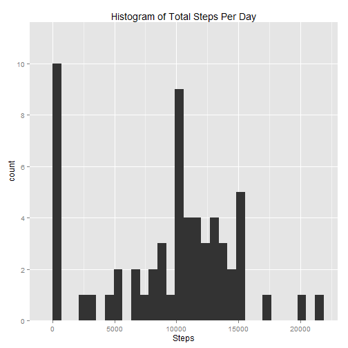
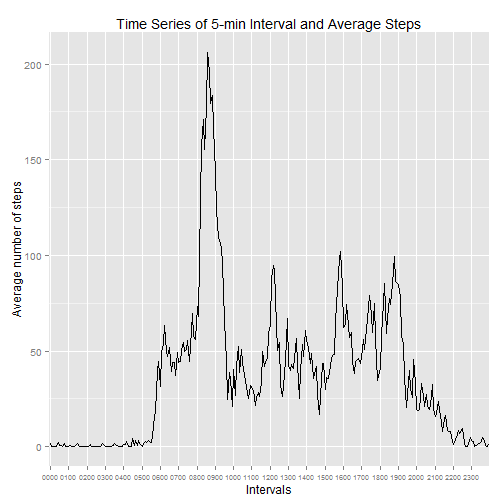
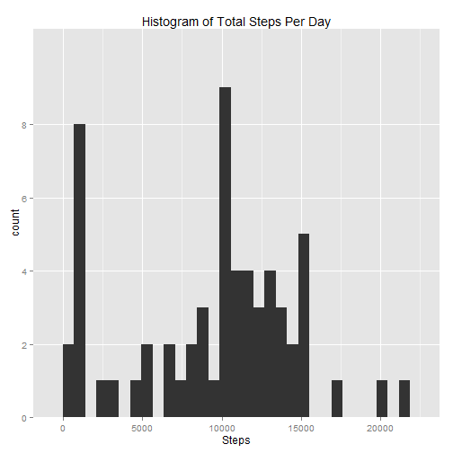
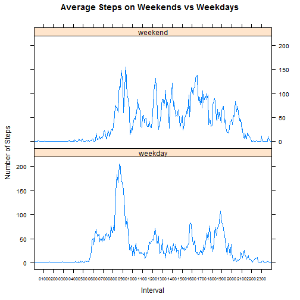

# Reproducible Research: Peer Assessment 1
This project explores peronsal movement pattern of an anonymous using a personal activity monitoring device. This device collects data at 5 minute intervals through out the day. The data consists of two months of data from an anonymous individual collected during the months of October and November, 2012 and include the number of steps taken in 5 minute intervals each day.  

## Loading and preprocessing the data  
Assume the working directory is already set to the folder that was folked from github repo which contains the zipped data file. We will first load the csv data file into a dataframe 'data'.

```r
unzip("activity.zip")
data <- read.csv("activity.csv")
```
The variables included are:  
* `steps`: Number of steps taking in a 5-minute interval (missing values are coded as NA)  
* `date`: The date on which the measurement was taken in YYYY-MM-DD format  
* `interval`: Identifier for the 5-minute interval in which measurement was taken  
There are a total of 17568 observations in this dataset.  

A quick look at the data shows that the interval is coded as following: 

```r
data$interval[c(1:2,12:14)]
```

```
## [1]   0   5  55 100 105
```
0 = 12:00am, 5 = 12:05am, 55 = 12:55 am, 100 = 1:00 am, 105 = 1:05 am 
If the original values were used to plot time series, it would introduce false values and therefore skew the plot. Here, we coherce the interval variable to a factor to be used for x-axis. We will also convert date column to date class for easier manipulation later.

```r
data$date <- as.Date(data$date)
data$interval <- as.factor(data$interval)
library(dplyr)
library(ggplot2)
```
At the same time, we created a vector coding the time, which will be used to label time intervals with better readability.

```r
Sys.setenv(TZ='GMT')
HMlabels <- format(
    seq(from = as.POSIXct(data$date[1]), length.out = 24, by = "1 hour"),"%H%M")
```
## What is mean total number of steps taken per day?  
Calculate the total number of steps taken each day.

```r
dailyStats <- data %>%
    group_by(date) %>%
    summarise(total = sum(steps, na.rm=TRUE))
```
Plot a histogram of the total number of steps taken each day.  

```r
qplot(total, data=dailyStats, main="Histogram of Total Steps Per Day", xlab="Steps") +
    scale_y_discrete(breaks=seq(0,10,2))
```

 

Next, calculate the mean and median of total number of steps taken per day.  

```r
mean <- mean(dailyStats$total, na.rm=TRUE)
median <- median(dailyStats$total, na.rm=TRUE)
```
Mean of total number of steps taken per day is **9354.2** and median is **10395**.

## What is the average daily activity pattern?

Calculate the average number of steps taken in 5-minute interval, averaged across all days .

```r
intervalStats <- data %>%
    group_by(interval) %>%
    summarise(avg = mean(steps, na.rm=TRUE))
```
Plot a time series of the 5-minute interval (x-axis) and the average number of steps taken, averaged across all days (y-axis)

```r
ggplot(intervalStats, aes(interval, avg, group=1)) +
    geom_line() +
    labs(title="Time Series of 5-min Interval and Average Steps", x="Intervals", y="Average number of steps") +
    scale_x_discrete(breaks=as.integer(HMlabels), labels=HMlabels) +
    theme(axis.text.x = element_text(size=7))
```

 

Find the 5-minute interval, on average across all the days in the dataset, which contains the maximum number of steps.

```r
int_max <- filter(intervalStats, avg==max(avg))
```
The interval with maximum number of steps, on average across all the days, is **835** with average of **206.2** steps. 

## Imputing missing values 

```r
NArows <- nrow(filter(data, is.na(steps)))
```
There are total 2304 intervals with missing values (coded as `NA`), whose presence may introduce bias into some calculations or summaries of the data.

For this analysis, we will fill in the missing values with the median for that 5-minute interval, assuming a personal daily activity pattern remains the same across days. Median is preferred over mean due to the reason that `steps` variable must be an integer. Rounding the mean value introduces unnecessary ambiguity. We create a new dataset `dataFilled`, that is equal to the original dataset but with the missing data filled in.

```r
intervalMed <- data %>%
    group_by(interval) %>%
    summarise(median = median(steps, na.rm=TRUE))
dataFilled <- merge(data, intervalMed, by="interval", all=TRUE)
dataFilled <- arrange(dataFilled, date, interval)
dataFilled$stepsF <- ifelse(is.na(dataFilled$steps), dataFilled$median, dataFilled$steps)
```
With the new dataset, plot a histogram of the total number of steps taken each day.

```r
dailyF <- dataFilled %>%
    group_by(date) %>%
    summarise(total = sum(stepsF))
```

```r
qplot(total, data=dailyF, main="Histogram of Total Steps Per Day", xlab="Steps") +
    scale_y_discrete(breaks=seq(0,10,2))
```

 

Next, calculate the mean and median of total number of steps taken per day.  

```r
meanF <- mean(dailyF$total, na.rm=TRUE)
medianF <- median(dailyF$total, na.rm=TRUE)
```
Mean of total number of steps taken per day is 9503.8689 and median is 10395.

With NAs filled with interval median, the mean has increased by 149.6 while the median difference is 0. 

## Are there differences in activity patterns between weekdays and weekends?

To differentiate weekdays from weekend days, we will create a  factor variable in the new dataset with two levels - "weekday" and "weekend", indicating whether a given date is a weekday or weekend day.

```r
dataFilled$dayType <- factor(ifelse(weekdays(dataFilled$date)
                                    %in% c("Saturday", "Sunday"), "weekend", "weekday"))
```
We will then make a panel plot containing a time series plot of the 5-minute interval (x-axis) and the average number of steps taken, averaged across all weekday days or weekend days (y-axis). 

```r
wkdayStats <- dataFilled %>%
    group_by(dayType, interval) %>%
    summarise(avgSteps=mean(stepsF))
```

```r
library(lattice)
xyplot(avgSteps ~ interval | dayType, data=wkdayStats,
       type ='l', layout=c(1,2),
       main="Average Steps on Weekends vs Weekdays",
       xlab="Interval",
       ylab="Number of Steps",
       scales=list(x=list(at=seq(0,287,12), labels=HMlabels,cex=0.6)))
```

 
